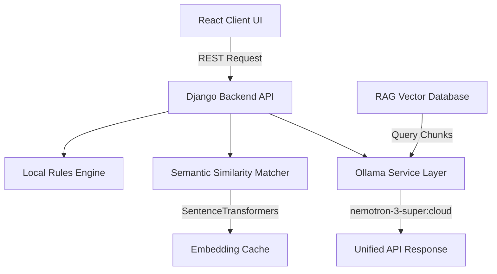

# Candidex AI - Architecture Guide

This document details the architectural layout, pipeline processing, and data flow configurations of Candidex AI.

## 🏗️ Architectural Layout

### 1. Frontend Architecture
- **Vite & React:** High-performance, modular build.
- **Framer Motion:** Premium micro-interactions and transitions.
- **lucide-react:** Reusable, clean asset library.

### 2. Backend & ML Intelligence
- **Django Rest Framework (DRF):** Handles API serialization, endpoints mapping, and onboarding states.
- **Heuristics Rules Engine:** Evaluates metrics (completeness score, action verb volume, contact references).
- **SentenceTransformers (`all-MiniLM-L6-v2`):** Generates 384-dimensional vector representations to match resumes against job descriptions.
- **Vector Cache:** Persists vector embeddings based on SHA-256 text hashes, reducing calculation delays.

### 3. Career Agent & RAG Pipeline
- **Intent Router:** Automatically parses candidate messages (career questions vs. formatting guidelines) to execute only required tools.
- **Pickle Vector Store:** In-memory, persistent vector database utilizing cosine similarity formulas.
- **Document Chunking:** Simple sliding window parser to segment reference markdown guidelines.

### 4. MLOps Observability Layer
- **AIObservabilityLogger:** Tracks execution times, fallback triggers, token counts, and prompt version parameters (`1.0.0` registries).
- **AI Evaluation Suite:** Computes Precision, Recall, and F1-score indicators against predefined ground-truth profiles.
