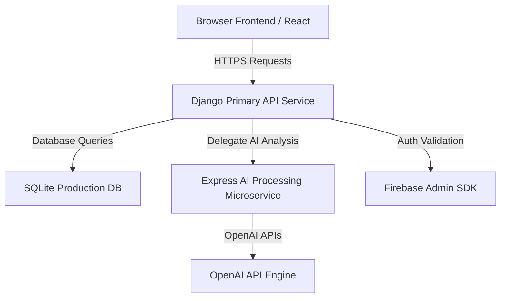

# Candidex AI - Production Deployment & Operations Guide

This guide details the deployment sequence, architecture configuration, environment requirements, and rollback procedures.

---

## 🏗️ System Architecture



---

## 🔑 Environment Variables Configuration

Create a `.env` file at the root of the services using these specifications:

### 1. Django API Backend (`/core`)
| Variable | Description | Recommended Production Value |
|---|---|---|
| `DEBUG` | Django debug toggle | `False` |
| `SECRET_KEY` | Production cryptographic seed | (Generate a high-entropy string) |
| `ALLOWED_HOSTS` | Authorized request hosts | `api.candidex.com,candidex.com` |
| `OPENAI_API_KEY` | OpenAI completion token | `sk-...` |
| `DATABASE_URL` | DB URL schema | `sqlite:///db.sqlite3` (or PostgreSQL schema) |
| `FIREBASE_ADMIN_SDK_BASE64` | Base64-encoded credentials | (Encode firebase-adminsdk.json file) |

### 2. Express AI Microservice (`/backend`)
| Variable | Description | Recommended Production Value |
|---|---|---|
| `PORT` | Microservice execution port | `4000` |
| `NODE_ENV` | Mode indicator | `production` |
| `FRONTEND_URL` | Main client domain | `https://candidex.com` |

---

## 🚀 Deployment Sequence & Builds

### Step 1: Build the Client
Navigate to `frontend/` to run optimization bundling:
```bash
cd frontend
npm ci
npm run build
```

### Step 2: Configure & Launch Express Backend
Navigate to `backend/` and start the server:
```bash
cd backend
npm ci
npm run start
```

### Step 3: Configure & Launch Django Backend
Navigate to the root workspace directory, run database migrations, collect static, and run with WSGI (Gunicorn/Uvicorn):
```bash
# Apply db changes
python manage.py migrate

# Collect assets
python manage.py collectstatic --noinput

# Run Django with gunicorn
gunicorn core.wsgi:application --bind 0.0.0.0:8000
```

---

## ⚕️ System Health Checks

Verify service status using these public heartbeat endpoints:
- **Primary Django API Health Check:** `https://api.candidex.com/status/`
- **Express Microservice Health Check:** `https://api.candidex.com:4000/health/`

---

## 🔄 Rollback Procedures
1. **Asset Rollback:** Restore the previous successful static folder build output from storage/CDN history.
2. **Database Rollback:** Keep scheduled automated SQLite database snapshot backups before migrating. In case of failure, run:
   ```bash
   cp db_backup_timestamp.sqlite3 db.sqlite3
   ```
